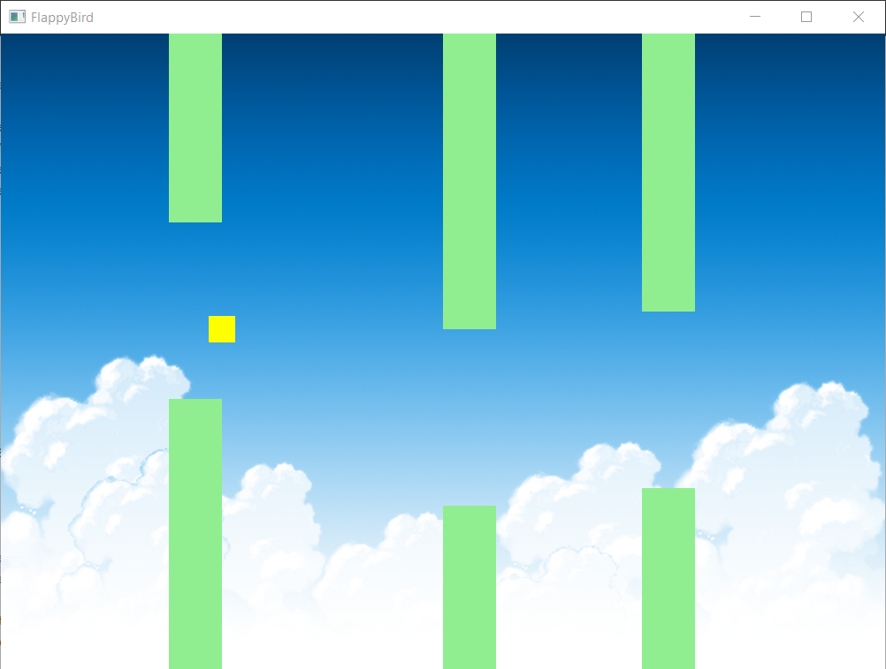
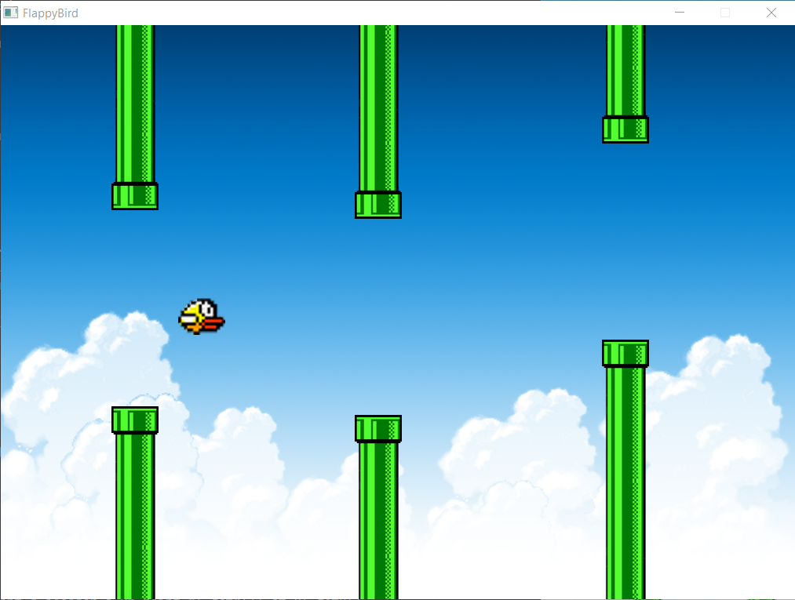
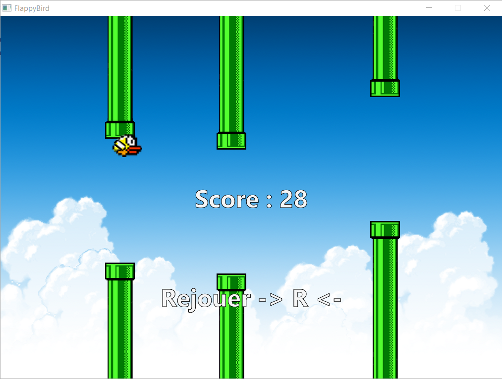
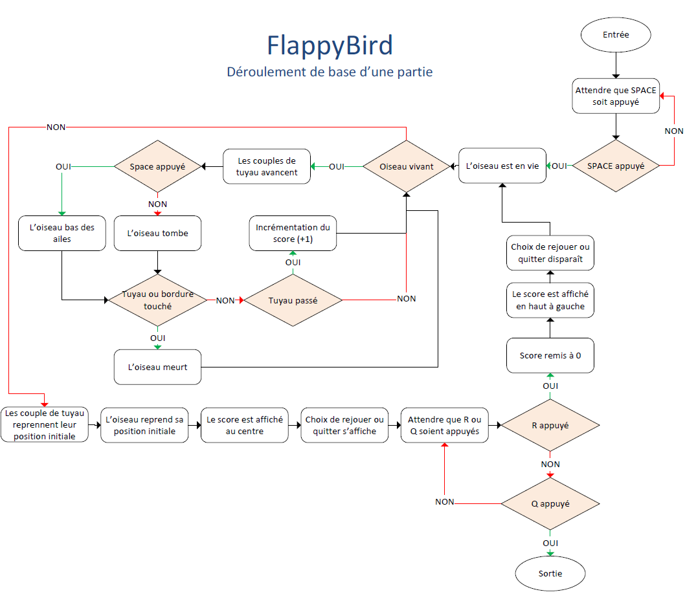

# 2020-JCO-FLAPPY-BIRD

- [2020-JCO-FLAPPY-BIRD](#2020-jco-flappy-bird)
  - [Introduction](#introduction)
  - [Pré-requis](#pré-requis)
  - [But](#but)
  - [Évolution du jeu](#évolution-du-jeu)
    - [Première version du jeu](#première-version-du-jeu)
    - [Deuxième version du jeu](#deuxième-version-du-jeu)
    - [Troisième version du jeu](#troisième-version-du-jeu)
  - [Déroulement de base d'une partie](#déroulement-de-base-dune-partie)
- [Class](#class)
  - [Area](#area)
  - [Bird](#bird)
  - [Pipe](#pipe)
  - [PipeCouple](#pipecouple)
  - [Score](#score)
  - [UML des Class](#uml-des-class)

## Introduction
Projet d'une durée de 28 jours qui a pour but de repprendre un jeu célèbre et de le recréer par programmation orienté objet.

## Pré-requis
Language de programation : [Java](https://fr.wikipedia.org/wiki/Java_(langage) "Wikipédia : Java") 

Des bases en programmation orienté objet sont indispensable pour comprendre et mondifer ce projet

* SDK : [javaFX](https://gluonhq.com/products/javafx/ "Page de téléchargement")
* IDE Java : [IntelliJ IDEA](https://www.jetbrains.com/fr-fr/idea/ "Page principale de IntelliJ IDEA")

## But
Le joueur doit aider un oiseau à franchir des petits espace entre deux tuyaux

Si le joueur appuie sur une touche l'oiseau battera une fois des ails se qui le fera monter un peu, avant de recommencer à descendre, si le joueur fait monter l'oiseau trop haut, l'oiseau meurt.

Si l'oiseau touche le bas il meurt.

Le but est de passer le plus de tuyau possible

## Évolution du jeu

Voici les différentes évolutions majeures du projet

### Première version du jeu
<figure>

Un fond et des rectangles pour faire un oiseau et des tuyaux, l'oiseau vole mais aucune collision n'est détectée
</figure>

### Deuxième version du jeu
<figure>

Ajout de sprite sur les rectangles, les collisions sont maitenant détectée
</figure>

### Troisième version du jeu
<figure>

Ajout et gestion du score, un écran d'accueil est maintenant là, il est aussi possible de rejouer après la mort de l'oiseau
</figure>

## Déroulement de base d'une partie
Le déroulement de base d'une partie est décrite dans ce [document PDF](docs/Ordinogramme.pdf)

# Class
La javaDoc hors-ligne du projet est disponible ici : [JavaDoc](docs/JavaDocs)

## Area

## Bird

## Pipe

## PipeCouple

## Score

## UML des Class
UML des classes
