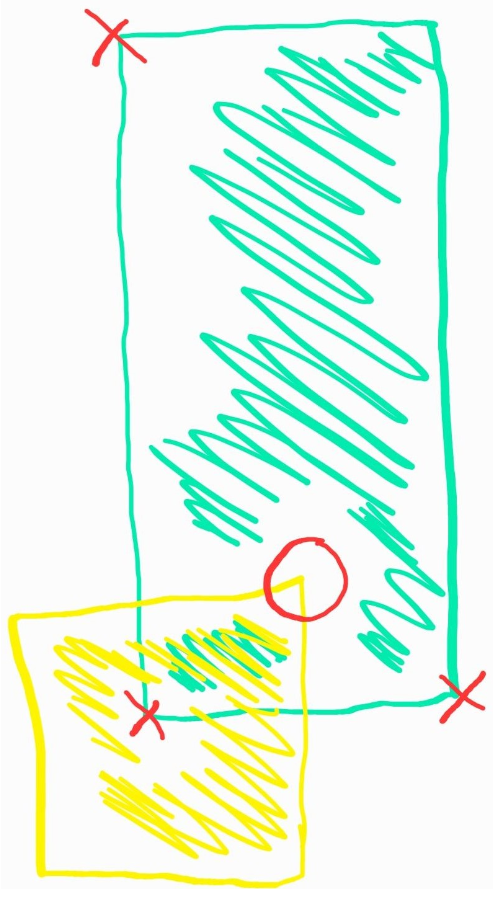

# 2020-JCO-FLAPPY-BIRD

## But :
un oiseau vole entre l'espace créé par un tuyau supérieur et un tuyau inférieur, s'il en touche un il meurt.

l'oiseau tombe en continue vers le bas, s'il touche le bas il meurt.

si le joueur appuie sur une touche l'oiseau battera une fois des ails se qui le fera monter un peu, avant de recommencer à descendre, si le joueur fait monter l'oiseau trop haut,
l'oiseau meurt.

le but est de passer le plus de couple de tuyaux

<figure>
    <figcaption>Première version du jeu</figcaption>
    
</figure>

<figure>
    <figcaption>Deuxième version du jeu</figcaption>

</figure>

## Sprite :

La classe Sprite hérite de la classe JavaFX Rectangle qui permet de créer des rectangles de taille voulue, de les placer à une coordonnée x/y souhaitée, ainsi que de choisir leur couleur.

La classe sprite ajoute 4 nouvelles fonctions qui permettent de déplacer le rectangle :
* moveLeft()
* moveRight()
* moveUp()
* moveDown()

Chaque sprite a comme varial membre une zone(area) de type Area.

la zone permet d'accéder à :
* getTopLeft()
* getTopRight()
* getDownLeft()
* getDownRight()

chacune de ces fonctions permettent d'accéder à un point X(.getX()) et Y(.getY()) qui forme ensemble la coordonnée représentant un des 4 coins du sprite.

```java 
public class Area {
    private CoordXY topLeft = new CoordXY();
    private CoordXY topRight = new CoordXY();
    private CoordXY downLeft = new CoordXY();
    private CoordXY downRight = new CoordXY();
    ...
```

Exemple : obtenir le coin supérieur gauche d'un carré :
```java
CoordXY topLeftCarré = new CoordXY(carré.getArea().getTopLeft().getX(),carré.getArea().getTopLeft().getY())
```

Chaque fois qu'un Sprite bouge, les coordonnées de area sont rafraîchies par le biais de refreshCoord() 

La fonction principal de la variable area sera de déterminer si deux object se touche ou non.

pour déterminer si deux object se touche, il suffit de comparer chaque coins de l'oiseau avec deux distance d'un tuyau
<figure>

</figure>
Si n'importe quel coin (ici haut-droit) de l'oiseau (en jaune) se situe entre le coin bas-gauche et bas-droit ET AUSSI entre le coin bas-gauche et haut-gauche d'un tuyau (en vert), il sera considéré comme "en collision"

## Les tuyaux :

les tuyaux détectent si l'bird passe dessus, si oui, c'est perdu.

immaginons que de base le tuyaux de haut et du bas se touche au centre de l'écran.

il doit y avoir un écart de **n** entre les deux tuyaux, a chaque apparition de couple de tuyau un chiffre aléatoir de 0 à **n** est tiré.

depuis le millieu de l'écran en augmente la valeur Y du tuyau du haut par la valeur tirée,
et on réduit la valeur Y du tuyau du bas par **n** - la valeur tirée, ce qui donnera un écart de **n** + une position aléatoire de l'espace.

```java
/**
 * Crée un espace égale à la valeur de spaceBetween entre deux tuyaux
 */
public void createSpace(){
int rndNum = getRandomNumber(0,spaceBetween);
this.pipe1.setTranslateY(this.pipe1.getTranslateY() - rndNum);
this.pipe2.setTranslateY(this.pipe2.getTranslateY() + (spaceBetween-rndNum));
}
```

## L'oiseau :
-l'oiseau tombe de base, en appuyant sur un touche, il monte progressivement d'une valeur fixe vers le haut, puis recommence a tombé

```java
/**
 * L'oiseau monte l'axe Y en fonction de sa force
 * @param strengh force de l'oiseau, plus elle est haute, plus il montera haut
 */
public void flap(int strengh) {
    this.setTranslateY(this.getTranslateY() - strengh);
}

/**
 * fait subir à l'oiseau une force de gravité, ce qui le poussera a tomber en continu
 * plus la gravité est élevée, plus il tombera vite
 * @param gravity force de gravité
 */
public void undergoGravity(int gravity) {
        this.moveDown(gravity);
}
```


## La scene :
la scène est un simple rectangle.

le bas et le haut tue l'oiseau.

la droite donne un point d'apparaission des tuyaux, la gauche donne un point de destruction des tuyaux.

## Les classes :
UML des classes
