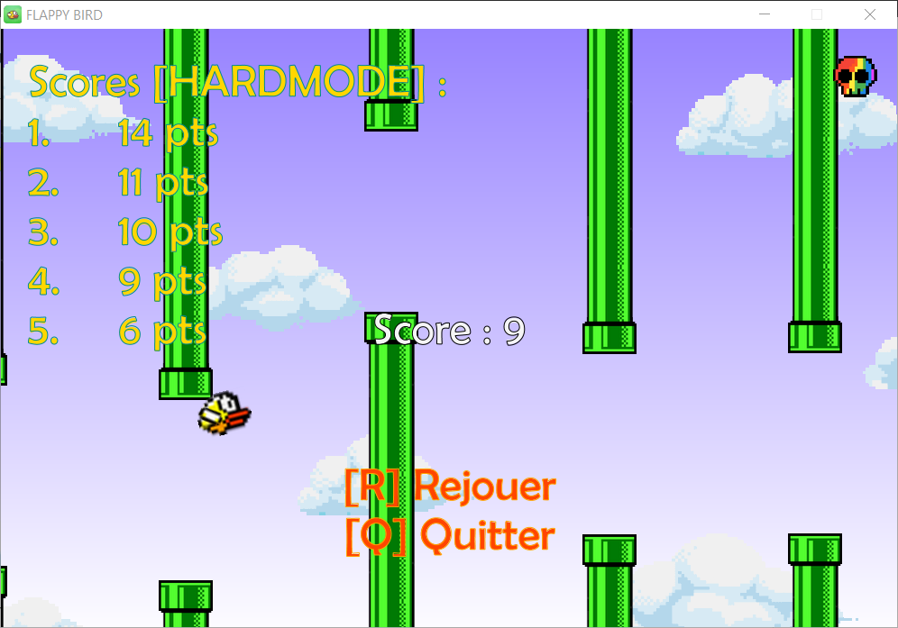
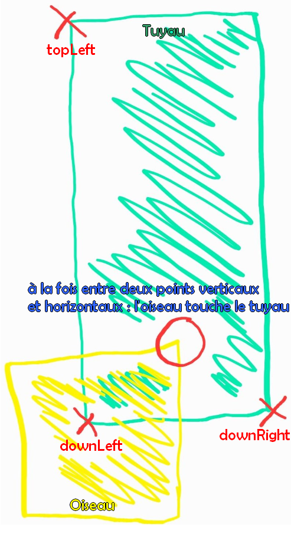

# 2020-JCO-FLAPPY-BIRD

- [2020-JCO-FLAPPY-BIRD](#2020-jco-flappy-bird)
- [Introduction](#introduction)
- [Pré-requis](#pré-requis)
- [But](#but)
- [Évolution du jeu](#évolution-du-jeu)
  - [Première version du jeu](#première-version-du-jeu)
  - [Deuxième version du jeu](#deuxième-version-du-jeu)
  - [Troisième version du jeu](#troisième-version-du-jeu)
  - [Quatrième version du jeu](#quatrième-version-du-jeu)
  - [Cinquième version du jeu](#cinquième-version-du-jeu)
- [Déroulement de base d'une partie](#déroulement-de-base-dune-partie)
- [Documentation](#documentation)
- [Class](#class)
  - [JavaDoc](#javadoc)
  - [Area](#area)
  - [Bird](#bird)
  - [Pipe](#pipe)
  - [PipeCouple](#pipecouple)
  - [Score](#score)

# Introduction
Projet d'une durée de 28 jours qui a pour but de repprendre un jeu célèbre et de le recréer par programmation orienté objet.

# Pré-requis
Language de programation : [Java](https://fr.wikipedia.org/wiki/Java_(langage) "Wikipédia : Java") 

Des bases en programmation orienté objet sont indispensables pour comprendre et modifer ce projet

* SDK : [javaFX](https://gluonhq.com/products/javafx/ "Page de téléchargement")
* IDE Java : [IntelliJ IDEA](https://www.jetbrains.com/fr-fr/idea/ "Page principale de IntelliJ IDEA")

# But
Le joueur doit aider un oiseau à franchir des petits espaces entre deux tuyaux

Si le joueur appuie sur la barre d'espace, l'oiseau battera des ailes une fois se qui le fera monter un peu, avant de recommencer à descendre, si le joueur fait monter l'oiseau trop haut, l'oiseau meurt.

Si l'oiseau touche le bas il meurt.

Le but est de passer le plus de tuyaux possible

# Évolution du jeu

Voici les différentes évolutions majeures du projet

## Première version du jeu
<figure>

Un fond et des rectangles pour faire un oiseau et des tuyaux, l'oiseau vole mais aucune collision n'est détectée
</figure>

## Deuxième version du jeu
<figure>

Ajout de sprite sur les rectangles, les collisions sont maitenant détectées
</figure>

## Troisième version du jeu
<figure>

Ajout et gestion du score, un écran d'accueil est maintenant là, il est aussi possible de rejouer ou de quitter l'application après la mort de l'oiseau
</figure>

## Quatrième version du jeu
<figure>

L'oiseau pique maintenant du bec en tombant, un fond animé défile lors de la partie, la vitesse des tuyaux à été diminiuée mais leur nombre à augmenté.
</figure>

## Cinquième version du jeu
<figure>

Il est possible d'activer le hardmode (mode difficile) en appuyant sur G dans le menu, dans ce mode les tuyaux bougent verticalement.

Une petite tête de mort sera là pour indiquer dans quel mode vous vous trouvez.

Il est possible de visualiser le tableau des 5 meilleur scores en appuyant sur TAB, changer de mode de jeu changera de tableau de score.
</figure>

# Déroulement de base d'une partie
Le déroulement de base d'une partie est décrite dans ce [document PDF](docs/Ordinogramme.pdf)

# Documentation
* [Documentation Technique](docs/FlappyBird_DocumentationTechnique.pdf)
* [JavaDoc](docs/JavaDocs)
* [Rapport de projet](docs/FlappyBird_RapportDeProjet.pdf)
* [Mode d'emploi](docs/FlappyBird_ModeDEmploi.pdf)

# Class

Voici un bref apperçu des différentes classes qui composent le jeu.

Les classes sont nettement plus détaillées dans le code source ainsi que dans la JavaDoc.

La documentation technique aide à la compréhension de certaines fonctions/pratiques utilisées

## JavaDoc
La javaDoc hors-ligne du projet est disponible ici : [JavaDoc](docs/JavaDocs)

## Area
La classe Area décrit une zone rectangulaire servant à détécter les bords limites d'un rectangle.

Un objet Area sera composé de 4 coordonnées XY de la classe CoordXY qui représenteront le coin haut-gauche, haut-droit, bas-gauche et bas-droit.

<figure>

Fonctionnement de la classe Area
</figure>

## Bird
La classe Bird décrit un oiseau pouvant voler, tomber, mourir et revivre.

La classe se compose d'une Area servant à détecter ses collisions ainsi que d'un sprite pour afficher une image de l'oiseau FlappyBird.

## Pipe
La classe Pipe réprésente un tuyaux qui peut détecter si l'oiseau l'a touché.

La classe se compose d'une Area servant à détecter ses collision ainsi que d'un sprite pour afficher une image de tuyau

## PipeCouple
La classe PipeCouple représente un couple de tuyaux (un en haut et un en bas) qui peut se déplacer de droite à gauche, générer un nouvel espace aléatoire entre eux-mêmes et donner des points au joueur.

La classe se compose de deux tuyaux de la classe Pipe

## Score
La classe Score réprsente un texte qui peut s'incrément ainsi que se remettre à zéro.

La classe se compose d'un objet Text.